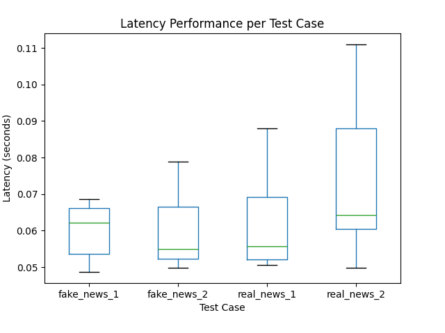

# ECE444-PRA5

REST API created through a Flask application that detects if a text is considered fake or real news. 

The API is deployed onto AWS Elastic Beanstalk and the endpoint is at http://pra5-ece444-env.eba-d45w3adj.us-east-2.elasticbeanstalk.com/predict. It is called in predict.py. 

Latency boxplot:

